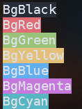
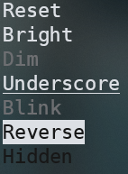
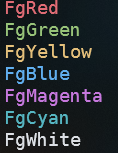
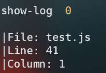

<h2 align="center">Show Log Package</h2>
<p align="center">
  
  
</p>

<p align="center">
  
  
  
  
</p>

#### Github repository
[github.com/di4m0nds/show-log](https://www.github.com/di4m0nds/show-log)

#### Description
<p>This package help you to debug your code with console log, but not is a normal console log. With this package you can to log with colors quickly and easily</p>

#### Installation
```bash
npm i @di4m0nds/show-log
```

### How to use this package?

#### #1 - Normal Message
```javascript
showLog('This is a message')
```
```bash
Console-> This is a message
```

#### #2 - AutoMessage
```javascript
showLog()
```
```bash
Console-> show-log 0
```
> if you put more than one showLog(), the number is changed

#### #3 - Color Message
```javascript
showLog('Some text', 'BgRed')
```
> this maybe help you for better visualization, you can see all colors in the previous images on top

#### #4 - Show the line quickly
```javascript
showThisLine()
```
```bash
Console-> |File: test.js
          |Line: 41
          |Column: 7
```
